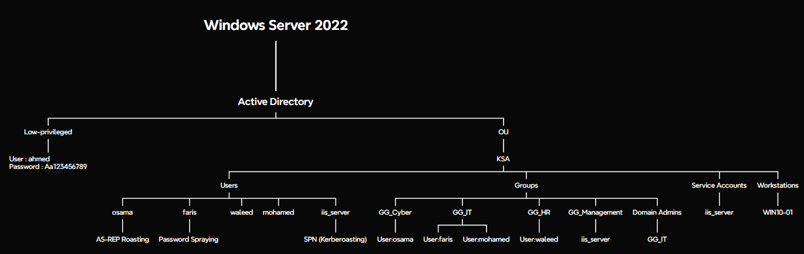

# AD-Home-Lab

> Complete Active Directory Home Lab built from scratch using PowerShell automation to simulate a real enterprise environment for Active Directory administration, security assessment, and penetration testing.

---

# Quick Start

## Download the Project

> **Important:** Run the following steps directly on the Windows Server machine as Administrator.  
> This lab is designed to be deployed on Windows Server to install and configure Active Directory Domain Services.

Run the following PowerShell command:


```powershell
Invoke-WebRequest "https://github.com/bex2030/AD-Home-Lab/archive/refs/heads/main.zip" -OutFile "C:\Users\Administrator\AD-Home-Lab.zip"
```

After the download is complete:

1. Open `C:\Users\Administrator`.
2. Double-click **AD-Home-Lab.zip**.
3. Drag the **AD-Home-Lab** folder to the Desktop.
4. Run all PowerShell scripts from the extracted folder as **Administrator**.

---

## Deployment

Run the PowerShell scripts in the following order:

```text
0-Rename-Server.ps1
01-Install-ADDS.ps1
02-Create-OUs.ps1
03-Create-Users.ps1
04-Create-Groups.ps1
05-Create-ServiceAccounts.ps1
06-Register-SPNs.ps1
07-Add-GroupMembers.ps1
08-Create-SMB-Shares.ps1
09-Disable-Defender-Firewall.ps1
```

> **Note**
>
> - `0-Rename-Server.ps1` automatically renames the server and restarts Windows.
> - `01-Install-ADDS.ps1` installs Active Directory Domain Services, creates the domain, and automatically restarts Windows.
> - After both automatic restarts, continue running the remaining scripts in numerical order.

---

## Download Wordlists (Kali Linux)

Clone the repository and navigate to the Wordlists directory:

```bash
git clone https://github.com/bex2030/AD-Home-Lab.git
cd AD-Home-Lab/Wordlists
```

The directory contains:

- `default_credentials.txt`
- `users.txt`
- `passwords.txt`

### Wordlist Details

These wordlists are custom-built for this lab and intended to be used from the Kali machine during the enumeration and password spraying phases:

- `default_credentials.txt` — contains the default username and password used to initially authenticate to the domain (e.g. RDP/WinRM login), representing the attacker's starting point of access in the lab scenario.
- `users.txt` — matches the domain usernames created during deployment (ahmed, faris, mohamed, waleed, osama), used as a target list for username enumeration and password spraying.
- `passwords.txt` — a small, lab-specific wordlist containing the weak passwords assigned to lab accounts, simulating a realistic password spraying attack against users who reused a common password.

> **Note**
>
> These wordlists are intentionally small and scenario-specific rather than general-purpose lists like `rockyou.txt`. In a real-world engagement, the attacker would not have this list in advance — it is provided here purely to make the lab reproducible for learning purposes.

---

## Create a Local Windows Account (No Microsoft Account)

During Windows 10/11 setup, open **Command Prompt** (`Shift + F10`) and run:

```cmd
start ms-cxh:localonly
```

This opens the local account creation wizard and allows Windows to be configured without signing in with a Microsoft account.

---
# Architecture



---

# Overview

AD-Home-Lab is a PowerShell-based Active Directory lab that automatically deploys a complete Windows Server environment for learning and practicing Active Directory administration, enumeration, and penetration testing.

The lab includes:

- Automated Active Directory deployment
- Organizational Units (OUs)
- Users and Groups
- Service Accounts and SPNs
- SMB Shares
- Wordlists for password spraying
- Attack scenarios such as Password Spraying, AS-REP Roasting, Kerberoasting, LDAP Enumeration, SMB Enumeration, and BloodHound

---

## Attack Flow

```text
ahmed
    │
    ▼
SMB Enumeration
    │
    ▼
support_notes.txt
    │
    ▼
Credential Discovery
    │
    ▼
Password Spraying
    │
    ▼
faris
    │
    ▼
GG_IT
    │
    ▼
Domain Admins

────────────────────────────

SPN Enumeration
        │
        ▼
Kerberoasting
        │
        ▼
Offline Password Cracking
        │
        ▼
iis_server

────────────────────────────

AS-REP Roasting
    │
    ▼
osama
```

---

# Table of Contents

- [Quick Start](#quick-start)
  - [Download the Project](#download-the-project)
  - [Deployment](#deployment)
  - [Download Wordlists (Kali Linux)](#download-wordlists-kali-linux)
  - [Create a Local Windows Account (No Microsoft Account)](#create-a-local-windows-account-no-microsoft-account)
- [Architecture](#architecture)
- [Overview](#overview)
- [Attack Flow](#attack-flow)
- [Features](#features)
- [Lab Environment](#lab-environment)
- [Hardware Requirements](#hardware-requirements)
- [Virtual Machine Resources](#virtual-machine-resources)
- [Network Configuration](#network-configuration)
- [Domain Information](#domain-information)
- [Active Directory Structure](#active-directory-structure)
- [Services](#services)
- [Lab Scenario](#lab-scenario)
- [Attack Scenarios](#attack-scenarios)
- [Defensive Concepts](#defensive-concepts)
- [Tools Used](#tools-used)
- [Learning Outcomes](#learning-outcomes)
- [Future Improvements](#future-improvements)
- [Screenshots](#screenshots)
- [Author](#author)

---

# Features

- Automated Active Directory Deployment
- PowerShell Automation
- Organizational Units (OUs)
- Users and Security Groups
- Nested Active Directory Groups
- Service Accounts
- Kerberos SPN Configuration
- Domain-Joined Workstations
- IIS Web Server
- SMB Shares
- Credential Exposure Scenario
- Password Spraying
- Password Reuse
- Kerberoasting
- AS-REP Roasting
- BloodHound Attack Path Analysis
- Enterprise-Style Active Directory Environment

---

# Lab Environment

| Machine | Operating System | Role |
|----------|------------------|------|
| DC-01 | Windows Server 2022 | Domain Controller |
| WIN10-01 | Windows 10 | Domain Client |
| Kali | Kali Linux 2025.x | Attacker Machine |

---

# Hardware Requirements

| Component | Recommended |
|------------|-------------|
| CPU | 4 Cores |
| RAM | 16 GB |
| Storage | 100 GB |
| Hypervisor | VMware Workstation Pro |
| Network | NAT |

---

# Virtual Machine Resources

## DC-01

```text
CPU: 2 Cores
RAM: 4 GB
Storage: 60 GB
```

## WIN10-01

```text
CPU: 2 Cores
RAM: 2 GB
Storage: 40 GB
```

## Kali Linux

```text
CPU: 2 Cores
RAM: 2 GB
Storage: 40 GB
```

### Lab Purpose

- Internal Security Assessment
- Active Directory Enumeration
- Attack Simulation

---

# Network Configuration

| Setting | Value |
|---------|-------|
| Hypervisor | VMware Workstation Pro |
| Network Mode | NAT |
| IP Assignment | VMware DHCP |

All virtual machines obtain their IP addresses automatically from VMware DHCP.

---

# Domain Information

| Setting | Value |
|---------|-------|
| Domain | `cyber.local` |
| NetBIOS | `CYBER` |


---

# Deployment

Run the following PowerShell scripts from an elevated PowerShell session on the Domain Controller in the following order.

> **Note**
>
> Run **0-Rename-Server.ps1** first. The server will automatically restart after the computer name is changed.
>
> After Windows starts again, run **01-Install-ADDS.ps1**. Active Directory will be installed, the domain will be created, and the server will automatically restart again.
>
> Once the second restart is complete, continue running the remaining scripts in numerical order.

```powershell
0-Rename-Server.ps1
01-Install-ADDS.ps1
02-Create-OUs.ps1
03-Create-Users.ps1
04-Create-Groups.ps1
05-Create-ServiceAccounts.ps1
06-Register-SPNs.ps1
07-Add-GroupMembers.ps1
08-Create-SMB-Shares.ps1
09-Disable-Defender-Firewall.ps1
```

---

# Active Directory Structure

```text
cyber.local

└── KSA
    ├── Users
    │   ├── ahmed
    │   ├── faris
    │   ├── mohamed
    │   ├── waleed
    │   └── osama
    │
    ├── Groups
    │   ├── GG_IT
    │   ├── GG_HR
    │   ├── GG_Cyber
    │   └── GG_Management
    │
    ├── Service Accounts
    │   └── iis_server
    │
    └── Workstations
        └── WIN10-01
```

# Services


## Active Directory

- User Management
- Group Management
- Organizational Units (OUs)
- Kerberos Authentication
- Security Groups

## DNS

- Forward Lookup Zone
- Domain Name Resolution
- Client Domain Joining

## IIS

| Setting | Value |
|---------|-------|
| Website | CyberLab |
| Port | 80 |

## SMB File Shares

| Share | Permission |
|--------|------------|
| IT | GG_IT |
| HR | GG_HR |
| Cyber | GG_Cyber |
| Management | GG_Management |

> **Note**
>
> The **IT** share grants read-only access to the **ahmed** account and contains a sample file (`support_notes.txt`) to simulate an internal credential exposure scenario used during Active Directory enumeration.

# Lab Scenario

This lab simulates a realistic internal Active Directory security assessment from the perspective of an authenticated domain user.

## Phase 1 – Initial Access

The assessment begins with the compromised credentials of **ahmed**, a low-privileged domain user.

```text
Username: ahmed
Password: Aa123456789
```

---

## Phase 2 – SMB Enumeration

Using the compromised **ahmed** account, the attacker enumerates accessible SMB shares.

The **IT** share contains an internal support note that was accidentally left behind after a password reset.

The note reveals the temporary password assigned to the **faris** account.

```text
\\DC-01\IT
        │
        ▼
support_notes.txt
        │
        ▼
Username: faris
Password: Aa123456789
```

### Demonstrates

- SMB Enumeration
- Credential Discovery
- Insecure Credential Storage

---

## Phase 3 – Password Spraying

Using the password discovered in the IT support note, the attacker performs a password spraying attack against domain users, identifying multiple accounts using the same password, including **faris**.

```text
support_notes.txt
        │
        ▼
Password Spraying
        │
        ▼
Multiple Accounts
        │
        ├── ahmed
        ├── faris
        ├── mohamed
        ├── waleed
        └── osama
                │
                ▼
faris
                │
                ▼
GG_IT
                │
                ▼
Domain Admins
```

The **faris** account is selected for further exploitation because **GG_IT** is nested inside **Domain Admins**, resulting in **Domain Administrator** privileges.

### Demonstrates

- Password Spraying
- Password Reuse
- Nested Group Privilege Escalation

---

## Phase 4 – Kerberoasting

The **iis_server** service account is configured with an HTTP Service Principal Name (SPN).

The attacker enumerates Service Principal Names (SPNs), requests a Kerberos service ticket for the **iis_server** account, and performs offline password cracking to recover the service account credentials.


```text
Username: iis_server
Password: Password123!
```

### Demonstrates

- SPN Enumeration
- Kerberoasting
- Offline Password Cracking

---

## Phase 5 – AS-REP Roasting

The **osama** account has Kerberos pre-authentication disabled.

The attacker performs an AS-REP Roasting attack to obtain an AS-REP hash for the **osama** account without prior knowledge of the user's password.

After cracking the hash offline, the attacker recovers the account credentials.

```text
Username: osama
Password: Pass0rd1
```

### Demonstrates

- AS-REP Roasting
- Offline Password Cracking

---

# Attack Scenarios

The lab supports the following attack scenarios:

- Active Directory Enumeration
- LDAP Enumeration
- SMB Enumeration
- SMB Share Discovery
- User Enumeration
- Credential Discovery
- Insecure Credential Storage
- Password Spraying
- Password Reuse
- SPN Enumeration
- Kerberoasting
- AS-REP Roasting
- PowerView Enumeration
- SharpHound Data Collection
- BloodHound Analysis
- SMB Permission Testing
- Nested Group Privilege Escalation

---

# Defensive Concepts

The lab also demonstrates the following defensive concepts:

- Least Privilege
- Security Groups
- Nested Group Management
- Service Account Management
- SMB Permissions
- Password Policies
- Credential Protection
- Kerberos Authentication
- Active Directory Hardening
- Windows Firewall
- Security Auditing

---

# Tools Used

## Infrastructure

- VMware Workstation Pro
- Windows Server 2022
- Windows 10
- Kali Linux
- PowerShell

## Enumeration

- Nmap — Network Discovery & Service Enumeration
- enum4linux — SMB & LDAP Enumeration
- smbclient — SMB Share Enumeration
- rpcclient — RPC Enumeration
- Kerbrute — Kerberos User Enumeration

## Active Directory

- BloodHound — Attack Path Analysis
- PowerView — Active Directory Enumeration
- Rubeus — Kerberos Ticket Operations
- Mimikatz — Credential Extraction & Kerberos Attacks

## Offensive Security

- CrackMapExec — Password Spraying & Lateral Movement
- Impacket — Kerberos, SMB & Remote Execution
- Evil-WinRM — Remote PowerShell Access
- John the Ripper — Offline Password Cracking
- Hashcat — GPU-Accelerated Password Cracking
  
---

# Learning Outcomes

After completing this project, you will gain hands-on experience with:

- Deploying Active Directory using PowerShell
- Windows Server Administration
- Active Directory Management
- Organizational Units (OUs)
- Security Groups
- SMB Configuration
- Kerberos Authentication
- Active Directory Enumeration
- Credential Discovery
- Password Spraying
- Password Reuse Assessment
- Kerberoasting
- AS-REP Roasting
- BloodHound Analysis
- Privilege Escalation Techniques

---

# Future Improvements

- Group Policy (GPO)
- SQL Server
- Active Directory Certificate Services (AD CS)
- Sysmon
- Microsoft Defender
- LAPS
- Windows Event Forwarding (WEF)
- Wazuh SIEM Integration
- Elastic Stack Integration

---

# Screenshots

## Active Directory Users and Computers


## SMB Enumeration


## Password Spraying


## Kerberoasting


## AS-REP Roasting


## BloodHound


## IIS Website


## Domain Join


---

# Author

**Osama Aljohani**

## Certifications

- eCPPTv3
- eWPTXv3
- eWPTv2
- eJPTv2
